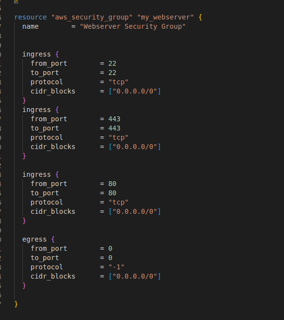

Державний вищий навчальний заклад

Ужгородський національний університет

Факультет інформаційних технологій

Лабораторна робота No4. Terraform 

Виконав студент ІІІ курсу

Напрям: «ІПЗ 2.1»

Назаренко Олександр Олександрович

Хід роботи

1.Створити імейдж убунту за допомогою тераформу

2/3.Дозволити доступ до HTTP/HTTPS та надати публічний SSH

4.Встановити сервер на зображення через баш скрипт 

Для цього в скріншоті вище я прописав юзер дату яка запускає баш скрипт який скачує апачі і запускає його 

Висновок: на цій лабораторній роботі я навчився користуватися terraform, працювати з AWS, підєднуватися до зображень через ssh key.

