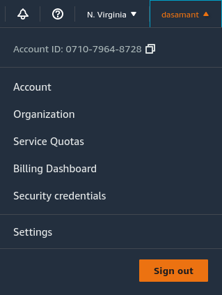
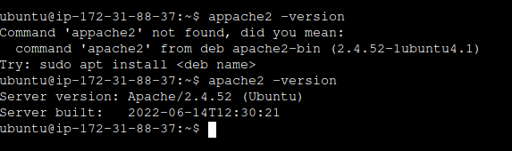

**Державний вищий навчальний заклад
Ужгородський національний університет
Факультет інформаційних технологій**

**ЛАБОРАТОРНА РОБОТА № 5**

**Тема:** Deploy на AWS. 

Виконав студент ІІІ курсу
Напрям: «ІПЗ 2-2» 
Назаренко Олександр Олександрович

Хід роботи

1. Зареєструватися на AWS

2. Створити інстанс ЕС2

3. Задеплоїти проект 

Висновок: на цій лабораторній роботі я навчився створювати AWS EC2 Instance за допомогою інтерфейсу AWS, коніфгурувати інстанс під сервер, та запускати власні сторінки через apache.

